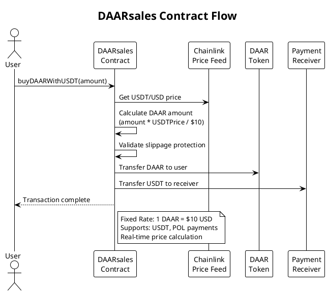
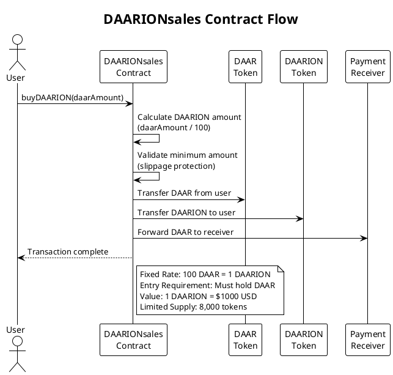
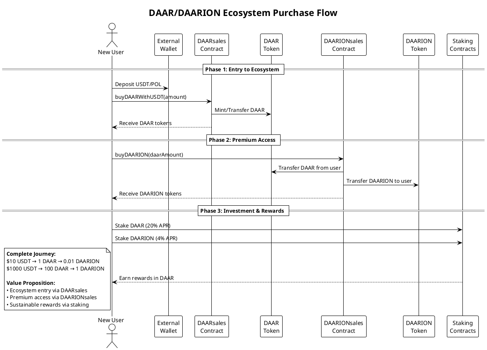

# DAAR and DAARION Smart Contracts
This README provides a comprehensive overview and guide to the DAAR and DAARION smart contracts, ensuring clarity and understanding for developers, stakeholders, and participants.

## Overview

The DAAR and DAARION smart contracts are designed to create an ecosystem for digital asset distribution and revenue sharing on the Polygon blockchain. These contracts provide mechanisms for automatic token distribution, staking, rewards, and most importantly, a complete token acquisition pipeline from fiat to premium investment tokens.

## Features

### DAAR
- **ERC20 Compliant**: Standard ERC20 token functionalities.
- **Burnable**: Allows the burning of tokens.
- **Pausable**: Can pause and unpause contract functionalities.
- **Transaction Fee**: A 0.5% fee on each transaction, sent to a designated wallet (`walletD`).
- **Upgradeable**: Supports role-based access and upgradeability.
#### How it works:


### DAARION
- **ERC20 Compliant**: Standard ERC20 token functionalities.
- **Burnable**: Allows the burning of tokens.
- **Pausable**: Can pause and unpause contract functionalities.
- **Sales Tax**: A 5% tax on each transaction, which is burned.
- **Upgradeable**: Supports role-based access and upgradeability.

### DAARsales
- **Token Gateway**: Direct purchase of DAAR tokens with USDT or POL
- **Fixed Pricing**: $10 USD per DAAR token
- **Chainlink Integration**: Real-time price feeds for accurate conversions
- **Multi-Payment Support**: Accepts USDT and Polygon's native POL token
- **Slippage Protection**: Built-in protection against price volatility

#### DAARsales Flow Diagram:


### DAARIONsales  
- **DAAR-Exclusive**: Only accepts DAAR tokens as payment
- **Fixed Exchange Rate**: 100 DAAR per 1 DAARION (1:100 ratio)
- **Premium Access**: Ensures buyers are already ecosystem participants
- **Slippage Protection**: 2% built-in slippage tolerance
- **Investment Gateway**: Bridge to premium ecosystem benefits

#### DAARIONsales Flow Diagram:


### Complete Ecosystem Flow:


### DAARDistributor
- **Staking**: Allows staking of DAARION tokens.
- **Rewards Distribution**: Distributes DAAR tokens as rewards based on staking.
- **Epoch Management**: Operates on epochs for reward distribution.

### APRStaking
- **Staking**: Allows staking of DAARION tokens.
- **APR Rewards**: Provides rewards based on a fixed Annual Percentage Rate (APR).
- **Upgradeable**: Supports role-based access and upgradeability.

## Smart Contract Details

### DAAR Contract


---

### DAARION Contract


---

### DAARsales Contract

The DAARsales contract serves as the primary entry point for new users to acquire DAAR tokens using traditional cryptocurrencies or fiat-backed stablecoins.

**Key Features:**
- **Fiat Gateway**: Accepts USDT (stablecoin) and POL (Polygon native token)
- **Real-time Pricing**: Uses Chainlink price feeds for accurate USD conversions
- **Fixed Rate**: 1 DAAR = $10 USD (pegged to honey-backed value)
- **Automatic Calculations**: Smart contract calculates exact token amounts
- **Slippage Protection**: Prevents unfavorable rate changes during transactions

**Process Flow:**
1. User approves USDT/POL spending to DAARsales contract
2. Contract queries Chainlink for current market rates
3. Calculates required payment amount for desired DAAR quantity
4. Validates slippage tolerance
5. Transfers payment tokens to treasury
6. Mints/transfers DAAR tokens to user

---

### DAARIONsales Contract

The DAARIONsales contract provides exclusive access to DAARION tokens for existing DAAR holders, maintaining ecosystem coherence and ensuring premium token buyers are committed participants.

**Key Features:**
- **DAAR-Only Payments**: Accepts only DAAR tokens (no external currencies)
- **Fixed Exchange Rate**: 100 DAAR = 1 DAARION (never changes)
- **Premium Positioning**: 1 DAARION = $1000 USD value
- **Ecosystem Lock-in**: Ensures buyers are already ecosystem participants
- **Limited Supply**: Only 8,000 DAARION tokens exist

**Process Flow:**
1. User must first hold DAAR tokens
2. User approves DAAR spending to DAARIONsales contract
3. Contract calculates DAARION amount (fixed 100:1 ratio)
4. Validates minimum output with slippage protection
5. Transfers DAAR from user to treasury
6. Transfers DAARION tokens to user

---
### DAARDistributor Contract


---
### APRStaking Contract


## Usage Examples

### Token Acquisition Journey

#### Step 1: Enter the Ecosystem (DAARsales)
```javascript
// Purchase DAAR with USDT
const usdtAmount = ethers.parseUnits("100", 6); // 100 USDT
await daarSalesContract.buyDAARWithUSDT(usdtAmount, minDAARAmount);
// Result: ~10 DAAR tokens (depending on slippage)

// Purchase DAAR with POL
await daarSalesContract.buyDAARWithPOL(minDAARAmount, { value: polAmount });
// Result: DAAR tokens equivalent to POL value
```

#### Step 2: Access Premium Features (DAARIONsales)
```javascript
// Purchase DAARION with DAAR (requires 100 DAAR minimum)
const daarAmount = ethers.parseEther("100"); // 100 DAAR
await daarionSalesContract.buyDAARION(daarAmount, minDAARIONAmount);
// Result: 1 DAARION token
```

#### Step 3: Earn Rewards (Staking)
```javascript
// Stake DAAR for 20% APR
await aprStakingContract.stakeDAAR(daarAmount);

// Stake DAARION for 4% APR + fee distribution
await daarDistributorContract.stakeDAARION(daarionAmount);
```

### DAAR Token

1. **Buying and Selling Products**
   - Use DAAR tokens to buy and sell organic products within the GreenFood cooperative.
2. **Transaction Fee**
   - Every transaction deducts a 0.5% fee sent to walletD.
   - For example, sending 100 DAAR results in 0.5 DAAR to walletD and 99.5 DAAR to the recipient.
3. **Reward Distribution**
   - Funds in walletD are distributed monthly among DAARION LP token holders.
   - DAAR rewards are allocated based on each holder's share in DAARION.
#### Use Case Diagram:


---

### DAARION Token

1. **Transaction Fee**
   - Each transaction applies a sales tax, where a portion of the tokens is burned.
   - For instance, transferring 100 DAARION results in a 5% tax and burn (5 DAARION burned, 95 DAARION received by the recipient).

---

### DAARDistributor Contract

1. **Staking DAARION**
   - Users stake their DAARION tokens to start earning DAAR rewards.
2. **Unstaking DAARION**
   - Users can unstake their DAARION tokens and receive their staked amount along with any accrued rewards.
3. **Claiming Rewards**
   - Users can claim their accumulated DAAR rewards based on their staked DAARION tokens.

---

### APRStaking Contract

1. **Stake Tokens**
   - Users stake a certain amount of DAARION tokens to start earning rewards.
2. **Claim Rewards**
   - Users can claim their accumulated rewards anytime.
3. **Unstake Tokens**
   - Users can unstake their tokens and receive rewards in DAAR.

## Economic Model

### Token Value Hierarchy
- **DAAR**: $10 USD (backed by honey assets)
- **DAARION**: $1000 USD (100 DAAR equivalent)
- **Entry Barrier**: Must hold DAAR to access DAARION
- **Scarcity**: Only 8,000 DAARION tokens vs 8,000,000 DAAR tokens

### Revenue Streams
1. **Transaction Fees**: 0.5% on all DAAR transfers
2. **Sales Margins**: Difference between market rates and fixed prices
3. **Staking Incentives**: Encourage long-term holding
4. **Ecosystem Growth**: Increased demand drives token values

---

For more details on the GreenFood cooperative and the DAAR and DAARION token ecosystem, visit [GreenFood.live](https://greenfood.live).
