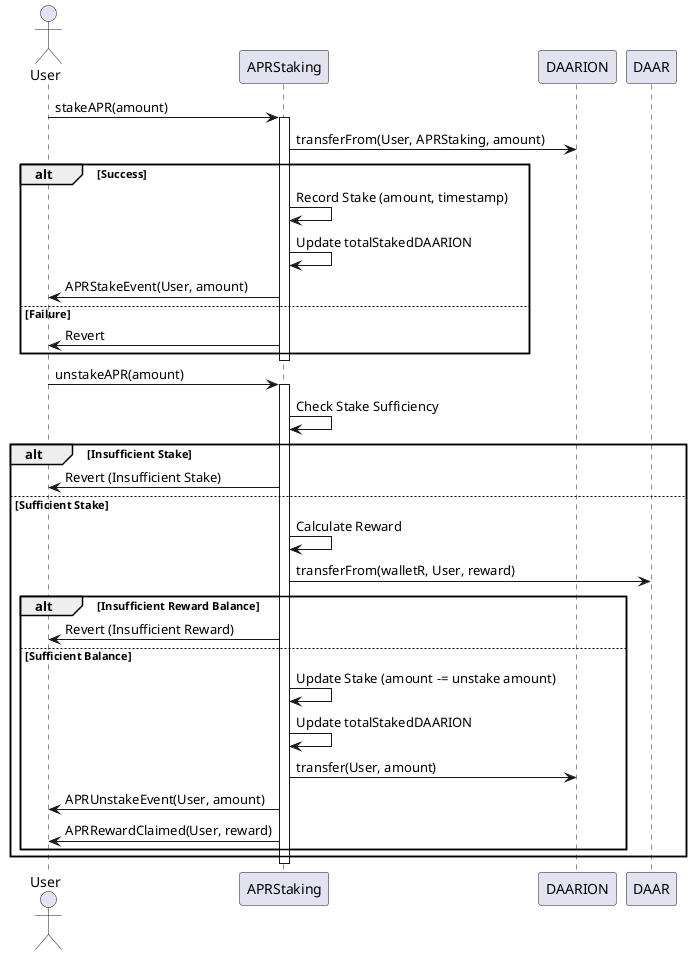

# Токени Екосистеми GreenFood

  

## DAAR Token (ERC-20)

DAAR - це токен, який використовується для купівлі та продажу продуктів у кооперативі органічних фермерів [GreenFood.live](https://greenfood.live). 0.5% від кожної транзакції надходить до гаманця для розподілу (walletD). Ці кошти щомісяця розподіляються між власниками токенів DAARION LP відповідно до їх частки у DAARION (вони отримують винагороду у вигляді DAAR). 

### Функціональність та Особливості  

1.  **Основні функції**
	-  **Токен ERC20**: DAAR є стандартним токеном ERC20.
	-  **Спалювання токенів**: DAAR токени можуть бути спалені, зменшуючи загальну кількість токенів в обігу.
	-  **Пауза**: Контракт може бути призупинений для запобігання транзакціям у разі потреби.

2.  **Розподіл комісій**
	-  **Транзакційна комісія**: 0.5% від кожної транзакції автоматично відправляється до walletD.
	-  **Розподіл серед учасників**: Кошти в walletD щомісяця розподіляються серед власників DAARION LP токенів.

3.  **Адміністрування та доступ**

	-  **Власник**: Власник контракту має особливі права, такі як встановлення комісії та розподіл ролей.
	-  **Роль розподільника**: Може бути призначений розподільник, який відповідає за розподіл DAAR токенів серед учасників.  

4.  **Інші функції**

	-  **Мінтинг (випуск) токенів**: Власник може випускати нові токени DAAR.
	-  **Виключення з комісії**: Деякі адреси можуть бути виключені з комісії.
	-  **Розподіл токенів**: Розподільник може розподіляти DAAR токени серед учасників.

### Діаграма


### Як це працює?

  

1.  **Купівля та продаж продуктів**

	- Використовуйте DAAR токени для купівлі та продажу органічних продуктів у кооперативі.  

2.  **Транзакційна комісія**

	- Кожна транзакція стягує 0.5% комісії, яка відправляється до walletD.
	- Наприклад, якщо ви відправляєте 100 DAAR, 0.5 DAAR буде відправлено до walletD, а 99.5 DAAR до отримувача.

3.  **Розподіл винагороди**

	- Щомісяця кошти у walletD розподіляються серед власників DAARION LP токенів.
	- Винагорода у DAAR розподіляється відповідно до частки кожного учасника у DAARION.

  

### Приклад використання

1.  **Реєстрація учасника**

	- Фермер приєднується до кооперативу, отримує DAAR токени для купівлі/продажу продуктів.  

2.  **Транзакція**

	- Фермер А відправляє 100 DAAR фермеру Б за продукти.
	- Фермер Б отримує 99.5 DAAR, а 0.5 DAAR надходять до walletD.

3.  **Місячний розподіл**

	- Кошти у walletD розподіляються серед власників DAARION LP токенів, які застейкали їх у DAARDistributor.
  

### Розширена діаграма функціоналу DAAR:


<details>
<title>UML-код</title>

@startuml

actor User
actor Owner
actor Distributor

participant "DAAR" as D

== Initialize ==

Owner -> D: initialize(DAAR, DAARION, epochLength, walletR)
D -> D: Initializes the contract

== Set Epoch Length ==

Owner -> D: setEpochLength(epochLength)
D -> D: Update epoch length

== Stake DAARION ==

User -> D: stakeDAARION(amount)
D -> D: updateEpoch()
D -> DAARION: transferFrom(msg.sender, address(this), amount)
D -> D: Stake amount and update rewards

== Unstake DAARION ==

User -> D: unstakeDAARION(amount)
D -> D: updateEpoch()
D -> D: Calculate pending rewards
D -> D: Transfer pending rewards
D -> DAARION: transfer(msg.sender, amount)
D -> D: Unstake amount and update records

== Claim Rewards ==

User -> D: claimRewards()
D -> D: updateEpoch()
D -> D: Calculate pending rewards
D -> D: Transfer pending rewards

== Distribute DAAR ==

Owner -> D: distributeDAAR()
D -> D: updateEpoch()
D -> D: Calculate rewards per share
D -> D: Distribute rewards

== Update Epoch ==

D -> D: updateEpoch()

== Stake APR ==

User -> D: stakeAPR(amount)
D -> DAARION: transferFrom(msg.sender, address(this), amount)
D -> D: Record APR stake

== Unstake APR ==

User -> D: unstakeAPR(amount)
D -> D: Calculate APR rewards
D -> DAAR: transferFrom(walletR, msg.sender, reward)
D -> DAARION: transfer(msg.sender, amount)
D -> D: Unstake APR amount

== Calculate APR Reward ==

User -> D: calculateAPRReward(staker)
D -> D: Calculate APR reward based on duration and APR rate

@enduml

</details>

## DAARDistributor Smart Contract

  

### Опис

  

`DAARDistributor` — це смарт-контракт, створений для керування стейкінгом і розподілом винагород у токенах DAAR і DAARION. Контракт також підтримує стейкінг з фіксованою річною процентною ставкою (APR), забезпечуючи стабільні винагороди для користувачів. Цей контракт пропонує гнучкість, безпеку та прозорість операцій.

  

### Особливості

-  **Стейкінг DAARION** — користувачі можуть стейкати токени DAARION для отримання винагород у DAAR.
-  **Анстейкінг DAARION** — користувачі можуть вивести свої стейкані токени DAARION та отримати накопичені винагороди.
-  **Отримання винагород** — користувачі можуть самостійно отримувати свої накопичені винагороди.
-  **Розподіл винагород** — власник контракту може розподілити накопичені винагороди серед користувачів.
-  **Стейкінг з APR** — користувачі можуть стейкати токени DAARION для отримання винагород із фіксованою річною процентною ставкою.
-  **Анстейкінг з APR** — користувачі можуть вивести свої APR стейкані токени DAARION та отримати APR винагороду.

  

### Переваги

  

-  **Безпека** — Контракт включає захист від повторних атак за допомогою ReentrancyGuard.
-  **Гнучкість** — Власник контракту може змінювати тривалість епох та інші параметри.
-  **Прозорість** — Всі важливі операції логуються через події, забезпечуючи прозорість усіх дій.
-  **Стабільні винагороди** — Можливість отримувати винагороди з фіксованою річною процентною ставкою (APR).
-  **Автоматичне розподілення** — Контракт автоматично керує винагородами та їх розподілом.

  

### Використання


1.  **Ініціалізація**:
	- Власник контракту викликає функцію `initialize`, щоб налаштувати початкові параметри.

2.  **Стейкінг DAARION**:
	- Користувачі викликають функцію `stakeDAARION`, щоб стейкати токени DAARION та отримувати винагороди.

3.  **Анстейкінг DAARION**:
	- Користувачі викликають функцію `unstakeDAARION` для виведення стейканих токенів.

4.  **Отримання винагород**:
	- Користувачі викликають функцію `claimRewards`, щоб отримати свої накопичені винагороди.

5.  **Розподіл винагород**:
	- Власник контракту викликає функцію `distributeDAAR`, щоб розподілити накопичені винагороди серед користувачів.

6.  **Стейкінг з APR**:
	- Користувачі викликають функцію `stakeAPR`, щоб стейкати токени DAARION для отримання APR винагород.

7.  **Анстейкінг з APR**:
	- Користувачі викликають функцію `unstakeAPR`, щоб вивести свої APR стейкані токени та отримати APR винагороду.

### Діаграма


    

## APRStaking Контракт

Звичайно, ось простий пояснювальний текст на українській мові, зрозумілий для органічних фермерів:

---

## Контракт APRStaking

Контракт `APRStaking` допомагає фермерам отримувати винагороди за зберігання своїх токенів `DAARION`. Коли ви ставите свої токени `DAARION` у цей контракт, ви отримуєте додаткові токени `DAAR` як винагороду.

### Як це працює?

1. **Ставка токенів (stake)**

    Ви можете поставити (застейкати) певну кількість токенів `DAARION`, які ви маєте. Ці токени будуть зберігатися у контракті `APRStaking`.

    ```solidity
    function stakeAPR(uint256 _amount) external nonReentrant
    ```

2. **Зняття токенів (unstake)**

    Коли ви хочете забрати свої токени, ви можете зняти їх з контракту. Окрім повернення ваших токенів `DAARION`, ви отримаєте додаткові токени `DAAR` як винагороду за те, що зберігали свої токени у контракті.

    ```solidity
    function unstakeAPR(uint256 _amount) external nonReentrant
    ```

3. **Розрахунок винагороди**

    Винагорода обчислюється залежно від того, скільки часу ваші токени були у контракті і яка фіксована річна процентна ставка (APR).

    ```solidity
    function calculateAPRReward(address staker) public view returns (uint256)
    ```

### Що ще важливо знати?

- **walletR** - це спеціальний гаманець, з якого виплачуються винагороди у вигляді токенів `DAAR`.
- **Події** - коли ви ставите або знімаєте токени, контракт надсилає повідомлення про це. Ви можете бачити ці повідомлення як підтвердження, що ваша операція успішна.

### Що вам дає цей контракт?

Контракт `APRStaking` дозволяє вам:

- Отримувати додаткові токени `DAAR` за зберігання ваших токенів `DAARION`.
- Впевненість у тому, що ваші токени безпечно зберігаються і можуть бути зняті у будь-який момент разом з винагородами.

Таким чином, ви можете заробляти більше, просто зберігаючи свої токени на контракті `APRStaking`.

---

### Функціонал та Особливості  

1. **Основні функції**

    - **stakeAPR** - ця функція дозволяє користувачам ставити певну кількість токенів `DAARION`. Токени переводяться з гаманця користувача на контракт `APRStaking`.
        ```solidity
        function stakeAPR(uint256 _amount) external nonReentrant
        ```

    - **unstakeAPR** - ця функція дозволяє користувачам знімати свої токени `DAARION` з контракту. Водночас користувачі отримують винагороду у вигляді токенів `DAAR`, розраховану за фіксованою річною процентною ставкою.
        ```solidity
        function unstakeAPR(uint256 _amount) external nonReentrant
        ```

    - **calculateAPRReward** - ця функція розраховує винагороду для користувача на основі часу, протягом якого токени були на контракті, та фіксованої річної процентної ставки.
        ```solidity
        function calculateAPRReward(address staker) public view returns (uint256)
        ```

2. **Внутрішні функції**

    - **initialize** - ця функція ініціалізує контракт, встановлюючи адреси токенів `DAAR`, `DAARION`, резервного гаманця (walletR) і власника (owner).
        ```solidity
        function initialize(address _DAAR, address _DAARION, address _walletR, address owner) public initializer
        ```

3. **Події**

    - **APRStakeEvent** - ця подія відправляється щоразу, коли користувач ставить токени `DAARION`.
        ```solidity
        event APRStakeEvent(address indexed user, uint256 amount)
        ```

    - **APRUnstakeEvent** - ця подія відправляється щоразу, коли користувач знімає свої токени `DAARION`.
        ```solidity
        event APRUnstakeEvent(address indexed user, uint256 amount)
        ```

    - **APRRewardClaimed** - ця подія відправляється щоразу, коли користувач отримує винагороду у вигляді токенів `DAAR`.
        ```solidity
        event APRRewardClaimed(address indexed user, uint256 reward)
        ```

### Деталі контракту

1. **Поля контракту**

    - **DAAR** - адреса контракту токена `DAAR`.
    - **DAARION** - адреса контракту токена `DAARION`.
    - **apr** - фіксована річна процентна ставка (APR).
    - **walletR** - резервний гаманець для винагород на основі APR.
    - **aprStakes** - мапа, яка відстежує кількість поставлених токенів та час початку ставки для кожного користувача.

2. **Структури даних**

    - **APRStake** - структура, яка зберігає інформацію про ставку користувача, включаючи кількість токенів та час початку ставки.
        ```solidity
        struct APRStake {
            uint256 amount;
            uint256 startTime;
        }
        ```

Цей контракт дозволяє користувачам ефективно ставити свої токени `DAARION` та отримувати винагороди у вигляді токенів `DAAR` на основі фіксованої річної процентної ставки.


<details><title>UML code</title>


</details>