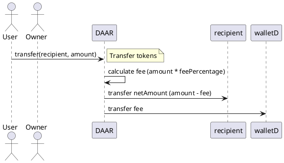
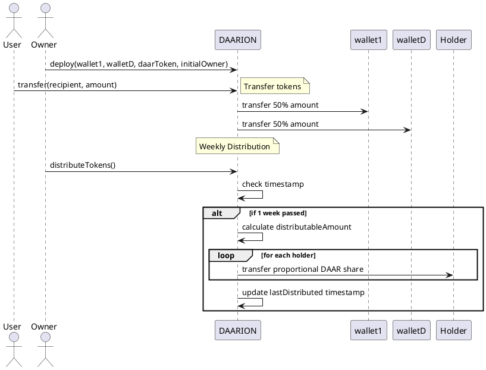

# DAAR and DAARION Smart Contracts

## Overview

DAAR (Digital Asset and Revenue) and DAARION are smart contracts designed to create an ecosystem for digital asset distribution and revenue sharing on the Amoy (Polygon Testnet) blockchain. These contracts provide mechanisms for automatic token distribution to specific wallets and weekly reward distribution to DAARION token holders.

## Features

- **DAAR (Digital Asset and Revenue)**
  - ERC20 compliant token for the ecosystem.
  - Built-in transaction fee mechanism directing a percentage of each transfer to a designated wallet (`walletD`).
  
- **DAARION**
  - Additional contract to complement DAAR functionalities.
  - Automates revenue sharing between multiple wallets.
  - Weekly distribution of DAAR tokens among DAARION token holders.
  - ERC20 compliant.

## Smart Contract Details

### DAAR Contract

  

**Purpose**: To provide a standard token with a transaction fee mechanism that directs a portion of each transfer to a designated distribution wallet.

**Constructor Parameters**:
- `walletD`: Address of the distribution wallet.
- `initialOwner`: Address of the initial contract owner.

**Key Functions**:
- **Transfer Tokens**: When a token transfer occurs, a percentage of the tokens is automatically sent to `walletD`.

### DAARION Contract

**Purpose**: To provide advanced features to complement DAAR, including distribution of revenues and weekly rewards to token holders.

**Constructor Parameters**:
- `wallet1`: Address for the first distribution wallet.
- `walletD`: Address of the distribution wallet (same as DAAR’s walletD).
- `daarToken`: Address of the DAAR token contract.
- `initialOwner`: Address of the initial contract owner.

**Key Functions**:
- **Transfer Tokens**: When tokens are transferred, the amount is split between `wallet1` and `walletD`.
- **Distribute Tokens**: Distributes DAAR tokens proportionally to all DAARION token holders every week.

## Weekly Distribution Mechanism

The DAARION contract ensures weekly distribution of DAAR tokens to its holders. Here’s how it works:

- **Weekly Check**: Every week, the contract checks if one week has passed since the last distribution.
- **Distribution Calculation**: The available DAAR tokens in the contract are distributed proportionally to all DAARION holders based on their token balance.

### Example Distribution

If the DAARION contract holds 1000 DAAR tokens for distribution:

- Holder A has 100 DAARION tokens.
- Holder B has 200 DAARION tokens.
- Holder C has 300 DAARION tokens.

Distribution:

- Total DAARION tokens = 100 + 200 + 300 = 600
- Holder A gets (100/600) * 1000 DAAR = 166.67 DAAR
- Holder B gets (200/600) * 1000 DAAR = 333.33 DAAR
- Holder C gets (300/600) * 1000 DAAR = 500 DAAR
