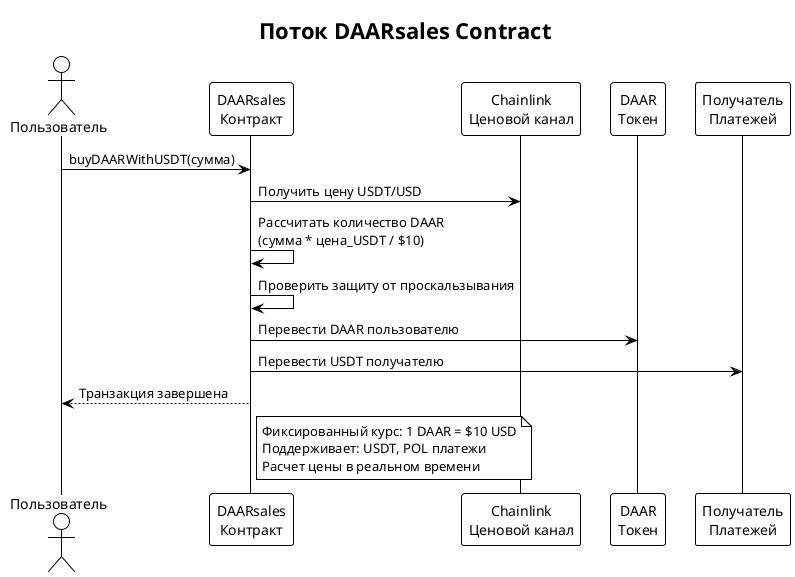
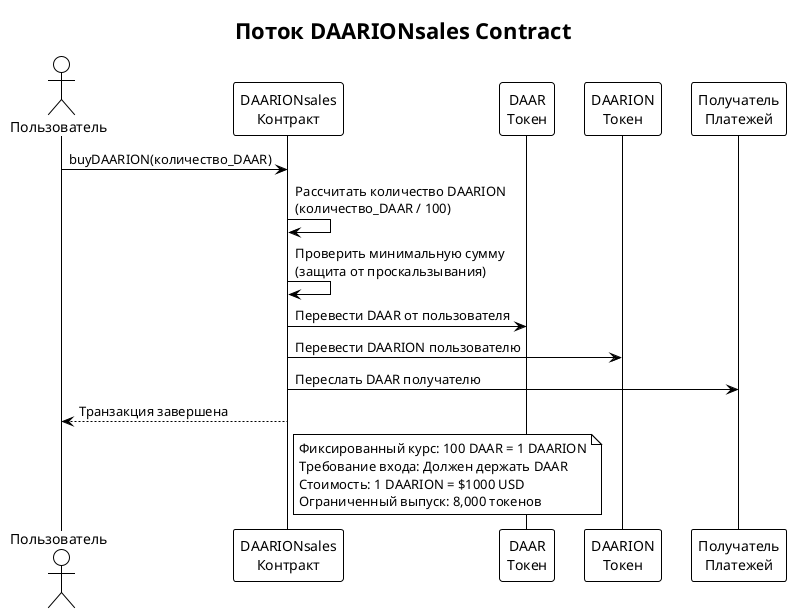
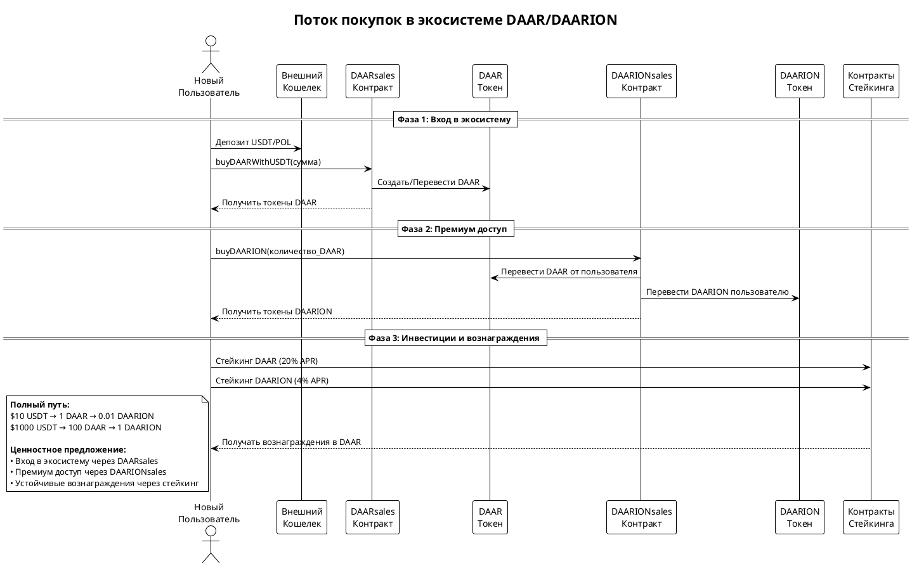

# Экосистема DAAR/DAARION

## Обзор проекта
Экосистема DAAR/DAARION представляет собой набор смарт-контрактов, предназначенных для управления токенами DAAR и DAARION, которые играют ключевую роль в платформе GreenFood. DAAR используется как платежный токен для покупки товаров GreenFood, а DAARION — как инвестиционный токен, доступный только в паре с DAAR. Экосистема включает в себя шесть основных смарт-контрактов: DAAR, DAARION, APRStaking, DAARDistributor, DAARsales и DAARIONsales, обеспечивающих полный цикл от приобретения токенов до получения инвестиционных доходов.

### Цель
- Управление платежами и инвестициями в рамках платформы GreenFood.
- Обеспечение прозрачности и безопасности транзакций.
- Поощрение участников через систему стейкинга и вознаграждений.
- Создание полного пути приобретения токенов от фиатных валют до премиум-инвестиций.

### Миссия
- Создать надежную и эффективную систему для управления токенами в экосистеме GreenFood.
- Обеспечить справедливое распределение вознаграждений и сборов.
- Предоставить простой путь входа в экосистему для новых пользователей.

### Видение
- Стать ведущей платформой для децентрализованных платежей и инвестиций в сфере устойчивого питания.
- Расширить возможности стейкинга и интеграции с другими DeFi-проектами.
- Создать самодостаточную экосистему с встроенными механизмами роста стоимости.

### Цели
- Реализовать систему сборов и вознаграждений, стимулирующую участие.
- Обеспечить безопасность и прозрачность всех транзакций.
- Упростить взаимодействие пользователей с платформой.
- Создать понятный путь инвестирования от начального до продвинутого уровня.

## Описание смарт-контрактов

### 1. DAAR
- **Назначение**: Основной платежный токен для покупок в GreenFood.
- **Особенности**:
  - Сбор комиссии 0.5% на каждый прямой перевод, которая направляется на адрес `walletD`.
  - Баланс `walletD` периодически распределяется через контракт DAARDistributor в зависимости от стейков.
- **Ключевые функции**:
  - `transfer`: Перевод токенов с комиссией.
  - `mint`: Чеканка новых токенов (только для роли MINTER_ROLE).
  - `burn`: Сжигание токенов (доступно для всех пользователей).

### 2. DAARION
- **Назначение**: Инвестиционный токен, торгуемый только в паре с DAAR.
- **Особенности**:
  - Сбор налога 5% на продажу, который сжигается.
  - Исключение из налога для определенных адресов (`wallet1`, `walletD`, `walletR`).
- **Ключевые функции**:
  - `transfer`: Перевод токенов с налогом.
  - `mint`: Чеканка новых токенов (только для роли MINTER_ROLE).
  - `burn`: Сжигание токенов (доступно для всех пользователей).

### 3. DAARsales
- **Назначение**: Шлюз для приобретения токенов DAAR за USDT или POL.
- **Особенности**:
  - Фиксированная цена: $10 USD за 1 DAAR
  - Интеграция с Chainlink для актуальных курсов валют
  - Поддержка USDT и POL (нативного токена Polygon)
  - Защита от проскальзывания
- **Ключевые функции**:
  - `buyDAARWithUSDT`: Покупка DAAR за USDT
  - `buyDAARWithPOL`: Покупка DAAR за POL
  - `calculateDAARAmount`: Расчет количества DAAR

#### Диаграмма потока DAARsales:


### 4. DAARIONsales
- **Назначение**: Эксклюзивный доступ к токенам DAARION только для держателей DAAR.
- **Особенности**:
  - Фиксированный курс: 100 DAAR за 1 DAARION
  - Принимает только токены DAAR в качестве оплаты
  - Встроенная защита от проскальзывания (2%)
  - Обеспечивает связность экосистемы
- **Ключевые функции**:
  - `buyDAARION`: Покупка DAARION за DAAR
  - `calculateDAARIONAmount`: Расчет количества DAARION

#### Диаграмма потока DAARIONsales:


### Полная схема экосистемы:


### 5. APRStaking
- **Назначение**: Контракт для стейкинга DAAR (20% APR) и DAARION (4% APR).
- **Особенности**:
  - Вознаграждения выплачиваются в DAAR.
  - Поддерживает стейкинг как DAAR, так и DAARION.
- **Ключевые функции**:
  - `stakeDAAR`: Стейкинг DAAR.
  - `unstakeDAAR`: Вывод стейкнутых DAAR.
  - `claimRewards`: Вывод накопленных вознаграждений.

### 6. DAARDistributor
- **Назначение**: Распределение сборов с DAAR в зависимости от стейков DAARION.
- **Особенности**:
  - Вознаграждения распределяются периодически (раз в эпоху).
  - Поддерживает стейкинг DAARION.
- **Ключевые функции**:
  - `stakeDAARION`: Стейкинг DAARION.
  - `unstakeDAARION`: Вывод стейкнутых DAARION.
  - `claimRewards`: Вывод накопленных вознаграждений.

## Архитектура
- **Сбор комиссий**: Все комиссии с переводов DAAR направляются на `walletD`.
- **Распределение**: Периодически баланс `walletD` передается на DAARDistributor, где распределяется среди стейкеров DAARION пропорционально их стейкам.
- **Стейкинг**:
  - DAAR можно стейкнуть в APRStaking для получения 20% APR.
  - DAARION можно стейкнуть в DAARDistributor для получения доли от комиссий DAAR.
- **Пути приобретения**:
  - **Новые пользователи**: USDT/POL → DAAR (через DAARsales) → доступ к экосистеме
  - **Держатели DAAR**: DAAR → DAARION (через DAARIONsales) → премиум преимущества
  - **Инвесторы**: многоэтапный путь: фиат → DAAR → DAARION → вознаграждения от стейкинга

## Примеры использования

### Путешествие по приобретению токенов

#### Шаг 1: Вход в экосистему (DAARsales)
```javascript
// Покупка DAAR за USDT
const usdtAmount = ethers.parseUnits("100", 6); // 100 USDT
await daarSalesContract.buyDAARWithUSDT(usdtAmount, minDAARAmount);
// Результат: ~10 токенов DAAR (в зависимости от проскальзывания)

// Покупка DAAR за POL
await daarSalesContract.buyDAARWithPOL(minDAARAmount, { value: polAmount });
// Результат: токены DAAR эквивалентные стоимости POL
```

#### Шаг 2: Доступ к премиум функциям (DAARIONsales)
```javascript
// Покупка DAARION за DAAR (требуется минимум 100 DAAR)
const daarAmount = ethers.parseEther("100"); // 100 DAAR
await daarionSalesContract.buyDAARION(daarAmount, minDAARIONAmount);
// Результат: 1 токен DAARION
```

#### Шаг 3: Получение вознаграждений (Стейкинг)
```javascript
// Стейкинг DAAR для 20% APR
await aprStakingContract.stakeDAAR(daarAmount);

// Стейкинг DAARION для 4% APR + распределение комиссий
await daarDistributorContract.stakeDAARION(daarionAmount);
```

## Экономическая модель

### Иерархия стоимости токенов
- **DAAR**: $10 USD (обеспечен медовыми активами)
- **DAARION**: $1000 USD (эквивалент 100 DAAR)
- **Барьер входа**: Необходимо держать DAAR для доступа к DAARION
- **Дефицитность**: Только 8,000 токенов DAARION против 8,000,000 токенов DAAR

### Потоки доходов
1. **Комиссии с транзакций**: 0.5% со всех переводов DAAR
2. **Маржа от продаж**: Разница между рыночными курсами и фиксированными ценами
3. **Стимулы стейкинга**: Поощрение долгосрочного держания
4. **Рост экосистемы**: Увеличенный спрос повышает стоимость токенов

## Развертывание и настройка
1. **Подготовка**:
   - Установите Truffle или Hardhat для развертывания контрактов.
   - Настройте среду для взаимодействия с Polygon.

2. **Развертывание**:
   - Используйте скрипты для развертывания каждого контракта.
   - Укажите адреса `wallet1`, `walletD`, `walletR` при инициализации.

3. **Инициализация**:
   - Инициализируйте каждый контракт с необходимыми параметрами.

## Использование
- **Для DAAR**:
  - Переводите токены с помощью `transfer`.
  - Сжигайте токены с помощью `burn`.
- **Для DAARION**:
  - Переводите токены с помощью `transfer`.
  - Сжигайте токены с помощью `burn`.
- **Стейкинг**:
  - Стейкните DAAR в APRStaking.
  - Стейкните DAARION в DAARDistributor.
  - Выводите вознаграждения с помощью `claimRewards`.
- **Приобретение токенов**:
  - Покупайте DAAR через DAARsales за USDT/POL.
  - Покупайте DAARION через DAARIONsales за DAAR.

## Безопасность
- Используются модификаторы `onlyOwner` и роли (MINTER_ROLE, PAUSER_ROLE) для контроля доступа.
- Защита от повторного входа с помощью `ReentrancyGuardUpgradeable`.
- Все контракты поддерживают обновления через UUPS.

## Вкладчики и управление
- **Вкладчики**: Команда разработчиков и сообщество.
- **Управление**: Через мультисиг кошелек (`wallet1`).

## Будущее развитие
- Добавление новых функций стейкинга.
- Интеграция с другими DeFi-проектами.
- Оптимизация газовых затрат.
- Расширение способов оплаты в DAARsales.

## Лицензия
- [MIT License](https://opensource.org/licenses/MIT)

## Поддержка и сообщество
- **Сообщество**: Присоединяйтесь к [Discord](https://discord.gg/daarion) или [Telegram](https://t.me/yourchannel).
- **Документация**: Подробная документация доступна на [GitHub](https://github.com/connectplatform/daarion).