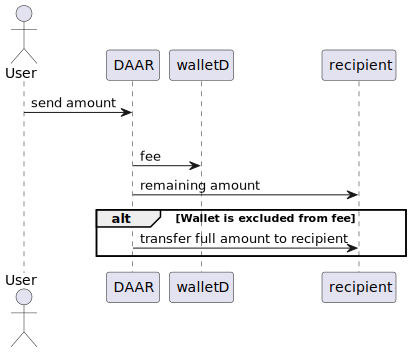

# DAAR and DAARION Smart Contracts
This README provides a comprehensive overview and guide to the DAAR and DAARION smart contracts, ensuring clarity and understanding for developers, stakeholders, and participants.

## Overview

The DAAR and DAARION smart contracts are designed to create an ecosystem for digital asset distribution and revenue sharing on the Polygon blockchain. These contracts provide mechanisms for automatic token distribution, staking, and rewards.

## Features

### DAAR
- **ERC20 Compliant**: Standard ERC20 token functionalities.
- **Burnable**: Allows the burning of tokens.
- **Pausable**: Can pause and unpause contract functionalities.
- **Transaction Fee**: A 0.5% fee on each transaction, sent to a designated wallet (`walletD`).
- **Upgradeable**: Supports role-based access and upgradeability.
#### How it works:

### DAARION
- **ERC20 Compliant**: Standard ERC20 token functionalities.
- **Burnable**: Allows the burning of tokens.
- **Pausable**: Can pause and unpause contract functionalities.
- **Sales Tax**: A 5% tax on each transaction, which is burned.
- **Upgradeable**: Supports role-based access and upgradeability.

### DAARDistributor
- **Staking**: Allows staking of DAARION tokens.
- **Rewards Distribution**: Distributes DAAR tokens as rewards based on staking.
- **Epoch Management**: Operates on epochs for reward distribution.

### APRStaking
- **Staking**: Allows staking of DAARION tokens.
- **APR Rewards**: Provides rewards based on a fixed Annual Percentage Rate (APR).
- **Upgradeable**: Supports role-based access and upgradeability.

## Smart Contract Details

### DAAR Contract

---

### DAARION Contract

---
### DAARDistributor Contract

---
### APRStaking Contract

## Usage Examples

### DAAR Token

1. **Buying and Selling Products**
   - Use DAAR tokens to buy and sell organic products within the GreenFood cooperative.
2. **Transaction Fee**
   - Every transaction deducts a 0.5% fee sent to walletD.
   - For example, sending 100 DAAR results in 0.5 DAAR to walletD and 99.5 DAAR to the recipient.
3. **Reward Distribution**
   - Funds in walletD are distributed monthly among DAARION LP token holders.
   - DAAR rewards are allocated based on each holder's share in DAARION.
#### Use Case Diagram:

---

### DAARION Token

1. **Transaction Fee**
   - Each transaction applies a sales tax, where a portion of the tokens is burned.
   - For instance, transferring 100 DAARION results in a 5% tax and burn (5 DAARION burned, 95 DAARION received by the recipient).

---

### DAARDistributor Contract

1. **Staking DAARION**
   - Users stake their DAARION tokens to start earning DAAR rewards.
2. **Unstaking DAARION**
   - Users can unstake their DAARION tokens and receive their staked amount along with any accrued rewards.
3. **Claiming Rewards**
   - Users can claim their accumulated DAAR rewards based on their staked DAARION tokens.

---

### APRStaking Contract

1. **Stake Tokens**
   - Users stake a certain amount of DAARION tokens to start earning rewards.
2. **Claim Rewards**
   - Users can claim their accumulated rewards anytime.
3. **Unstake Tokens**
   - Users can unstake their tokens and receive rewards in DAAR.

---

For more details on the GreenFood cooperative and the DAAR and DAARION token ecosystem, visit [GreenFood.live](https://greenfood.live).
